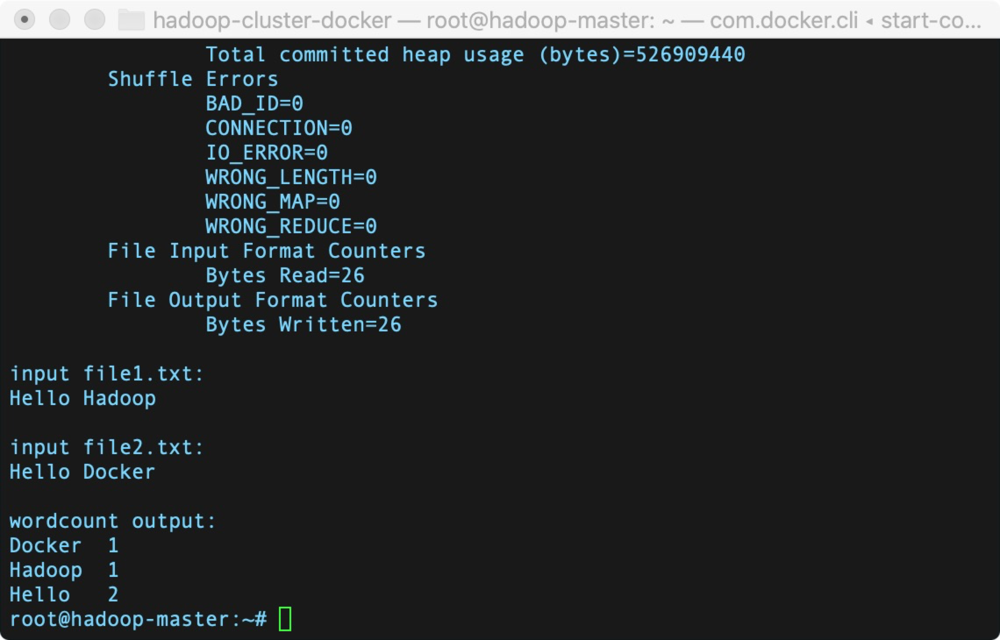

## Run Hadoop v3.3.1 within Docker Containers

`环境：MacOS BigSur`

`机型：Mac mini (M1, 2020)`


##### 1. clone github repository
```
git clone https://github.com/Weihong-Liu/hadoop-docker.git

cd hadoop-docker/hadoop-docker-aarch64
```
##### 2. download Hadoop v3.3.1 aarch64 and JDK v1.8 aarch64 to resource directory

> [hadoop-3.3.1-aarch64](https://dlcdn.apache.org/hadoop/common/hadoop-3.3.1/hadoop-3.3.1-aarch64.tar.gz) and [JDK1.8-aarch64](https://gitee.com/Bric666/java/attach_files/803375/download/jdk-8u301-linux-aarch64.tar.gz)

将下载得到的`hadoop-3.3.1-aarch64.tar.gz`和`jdk-8u301-linux-aarch64.tar.gz`文件放入`resources`文件夹中

##### 3. build Dockerfile
```
docker build -f Dockerfile -t puppets/hadoop:1.0 .
```

##### 4. create hadoop network

```
sudo docker network create --driver=bridge hadoop
```

##### 5. start container

```
cd hadoop-docker
sudo ./start-container.sh
```

**output:**

```
start hadoop-master container...
start hadoop-slave1 container...
start hadoop-slave2 container...
root@hadoop-master:~# 
```
- start 3 containers with 1 master and 2 slaves
- you will get into the /root directory of hadoop-master container

##### 6. start hadoop

```
./start-hadoop.sh
```

##### 7. run wordcount

```
./run-wordcount.sh 3.3.1(Hadoop对应版本号,自行替换)
```

**output**

```
input file1.txt:
Hello Hadoop

input file2.txt:
Hello Docker

wordcount output:
Docker    1
Hadoop    1
Hello    2
```

##### 8. WebUI
- http://localhost:9870/
- http://localhost:8088/


### Arbitrary size Hadoop cluster

##### 1. pull docker images and clone github repository

do 1~3 like section A

##### 2. rebuild docker image

```
sudo ./resize-cluster.sh 5
```
- specify parameter > 1: 2, 3..
- this script just rebuild hadoop image with different **slaves** file, which pecifies the name of all slave nodes


##### 3. start container

```
sudo ./start-container.sh 5
```
- use the same parameter as the step 2

##### 4. run hadoop cluster 

do 5~6 like section A

#### References
1. [银河麒麟 arm架构 ubuntu docker制作hadoop镜像](https://www.cnblogs.com/erlou96/p/13857749.html)
2. [Run Hadoop Cluster in Docker Update](http://kiwenlau.com/2016/06/26/hadoop-cluster-docker-update-english/)